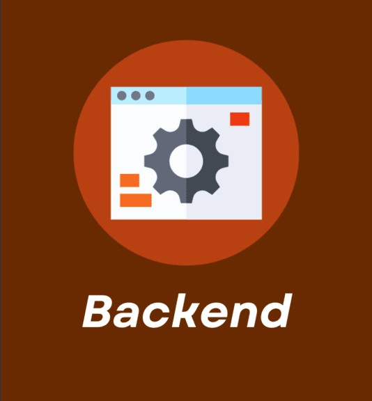

## Olá, sou Samuel Matias

🎓 Técnico de Informática em formação  
💻 Interessado em desenvolvimento back-end e front-end  
🚀 Buscando aprender novas tecnologias

---

## Sobre Mim

Sou **Técnico de Informática em formação no Centro Federal de Educação Tecnológica de Minas Gerais (CEFET-MG)**. Meu foco está no **desenvolvimento back-end e front-end**, mas tenho interesse em outras áreas, como **inteligência artificial**.

---

## Competências

### 👨‍💻 Linguagens de Programação

### 🌐 Desenvolvimento Web

### 🎲 Banco de Dados

### 🛠️ Ferramentas e Sistemas

---

## Principais Interesses
<table align="center">
  <tr>
    <td align="center" width="200">
        
        <b>Desenvolvimento Backend</b>
    </td>
    <td align="center" width="200">
        
        <b>Desenvolvimento Frontend</b>
    </td>
    <td align="center" width="200">
        
        <b>Inteligência Artificial</b>
    </td>
  </tr>
</table>

---

## 📚 Principais Projetos

<table align="center" width="100%">
  <tr>
    <td width="50%" valign="top">
      💡 <b>TCC</b>  
      Projeto voltado para o estudo e prática de linguagens de programação,
      explorando conceitos avançados e implementações práticas.  
      <a href="https://github.com/SEU_USUARIO/LLP2">
        🔗 <b>Ver Código</b>
      </a>
    </td>
    <td width="50%" valign="top">
      🤖 <b>Programa-METACEFET-2024</b>  
      Trabalho premiado por utilizar IA em websites imobiliários,
      explorando a API da OpenAI junto às bibliotecas Flask, LangChain e NLTK.  
      <a href="https://github.com/SEU_USUARIO/Programa-METACEFET-2024">
        🔗 <b>Ver Código</b>
      </a>
    </td>
  </tr>

  <tr>
    <td width="50%" valign="top">
      🛠️ <b>TrabalhoPratico2</b>  
      Projeto colaborativo que demonstra habilidades em trabalho em equipe
      e resolução de problemas práticos.  
      <a href="https://github.com/SEU_USUARIO/TrabalhoPratico2">
        🔗 <b>Ver Código</b>
      </a>
    </td>
    <td width="50%" valign="top">
      ➕ <b>Mais Projetos</b>  
      Explore todos os meus repositórios para acompanhar a evolução do meu
      aprendizado e projetos diversos.  
      <a href="https://github.com/SEU_USUARIO?tab=repositories">
        📂 <b>Todos os Projetos</b>
      </a>
    </td>
  </tr>
</table>

<!--
**SamuelMatiasSfr/SamuelMatiasSfr** is a ✨ _special_ ✨ repository because its `README.md` (this file) appears on your GitHub profile.

Here are some ideas to get you started:

- 🔭 I’m currently working on ...
- 🌱 I’m currently learning ...
- 👯 I’m looking to collaborate on ...
- 🤔 I’m looking for help with ...
- 💬 Ask me about ...
- 📫 How to reach me: ...
- 😄 Pronouns: ...
- ⚡ Fun fact: ...
-->
