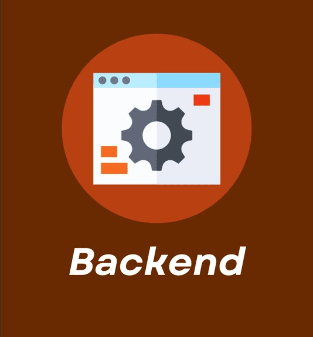

## Olá, sou Samuel Matias

🎓 Técnico de Informática em formação  
💻 Interessado em desenvolvimento back-end e front-end  
🚀 Buscando aprender novas tecnologias e uma oportunidade de aplicar meus conhecimentos na prática

---

## Sobre Mim

Sou **Técnico de Informática em formação no Centro Federal de Educação Tecnológica de Minas Gerais (CEFET-MG)**. Meu foco está no **desenvolvimento back-end e front-end**, mas tenho interesse em outras áreas, como **inteligência artificial**.

  

---

## Competências

### Linguagens de Programação

### Desenvolvimento Web

### Banco de Dados

### Ferramentas e Sistemas

---

## Principais Interesses
<table align="center">
  <tr>
    <td align="center" width="180">
       
      <b>Desenvolvimento Backend</b>
    </td>
    <td align="center" width="180">
       
      <b>Desenvolvimento Frontend</b>
    </td>
    <td align="center" width="180">
       
      <b>Inteligência</b> 
      <b>Artificial</b>
    </td>
  </tr>
</table>

---

## Principais Projetos

<table align="center" width="100%">
  <tr>
    <td width="50%" valign="top">
      🧠 <b>med_brain_scan</b>  
      Projeto desenvolvido que utiliza inteligência artificial para determinar a
      porcentagem de chance de ter tumor em uma imagem de ressonância magnética da
      região cerebral.  
      
    </td>
    <td width="50%" valign="top">
      🏫 <b>java_crud_academico</b>  
      Projeto em Java de CRUD de alunos, professores e técnicos-administrativos, 
      permitindo cadastro, edição e exclusão de registros.   
      
    </td>
  </tr>
  <tr>
    <td width="50%" valign="top">
      🕹 <b>cpp_remake_donkey_kong</b>  
      Remake do jogo Donkey Kong de Atari, desenvolvido
      utilizando C++ e a biblioteca SFML.  
      
    </td>
    <td width="50%" valign="top">
      ➕ <b>Mais projetos</b>  
      Explore os demais projetos que eu desenvolvi ou colaborei.   
      
    </td>
  </tr>
</table>

